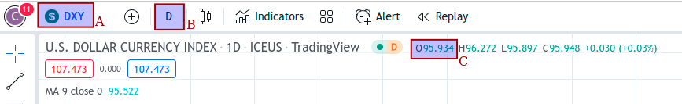

## Headers

| UMIP-166           |                                                      |
| ------------------- | ---------------------------------------------------- |
| UMIP Title          | Add **DXY** as a supported price identifier |
| Authors             | Sumero                                             |
| Status              | Last Call                                            |
| Created             | 2022.8.24    |
| Discourse Link      | https://discourse.umaproject.org/t/umip-add-dxy-usd-index-as-a-price-identifier/1797            |

# Summary

The DVM should support price requests for the [US Dollar Index](https://en.wikipedia.org/wiki/U.S._Dollar_Index) (DXY), which will track the MarketWatch reported value, using TradingView as a fallback source.

The canonical identifier should be `DXY`.

# Motivation

Adding DXY would allow synthetic assets for the US Dollar Index to be created, using Sumero's forked version of UMA's Expiring Multiparty (EMP) contracts, which UMA no longer supports.

The US Dollar Index is a measure of the value of USD relative to a weighted basket of foreign currencies. These currencies and their weights are:

1. Euro (EUR): 57.6 percent
2. Japanese Yen (JPY): 13.6 percent
3. British Pound (GBP): 11.9 percent
4. Canadian Dollar (CAD): 9.1 percent
5. Swedish Krona (SEK): 4.2 percent
6. Swiss Franc (CHF): 3.6 percent

# Data Specifications

- Price identifier name: DXY

- Example data providers:
    - https://www.tradingview.com/symbols/TVC-DXY/
    - https://www.marketwatch.com/investing/index/dxy

- Real-time data update frequency:
    - Daily

# Price feed implementation

Implemented as a price feed "plugin" [here](https://github.com/Signo-App/uma-protocol/blob/new-price-feed/packages/financial-templates-lib/src/price-feed/MarketStackPriceFeed.ts). Uses the MarketStack platform.

An example price feed config to pass into this script is:

`{"apiKey":"your_api_key_for_marketstack","type": "marketstack","lookback":604800, "symbolString":"DXY.INDX"}`

# Technical Specifications

- Price identifier name: DXY
- Rounding: Round to 2 decimal places (3rd decimal place digit >= 5 rounds up and < 5 rounds down)
- Estimated current value of price identifier: 106.534 (17 Aug 2022 09:19 UTC)

# Rationale

DXY is a calculated index that is very difficult to manipulate in the short term without exhorbitant cost, so no TWAP is needed.

We chose to use the daily open price, updated daily, because this is easier to fetch via various APIs for historical data.

# Implementation

*Voters should determine whether the price calculated as below differs from broad market consensus. This is meant to provide flexibility in any unforeseen circumstances as voters are responsible for defining broad market consensus.*

Voters should first determine the day of the request's timestamp, in the UTC time zone.

Voters should then go to https://www.marketwatch.com/investing/index/dxy/ and click on the "historical quotes" tab below the first chart, and find the "Open" price for the day corresponding to the timestamp. This should be reported as the final value.

## If MarketStack is inaccessible or no longer serves the needed data:

Voters should then go to https://www.tradingview.com/chart/?symbol=TVC%3ADXY, and make sure the interval is set to "1 day" (see B on the below image). Voters should then mouse-over the day determined, and look at the Open price (C on the below image) and record this number. This is the value for the TVC market.

Then voters should do the same for the additional two markets of CAPITALCOM and ICEUS. These can be chosen by clicking the DXY symbol on the top left (see A on the below image) and selecting the appropriate choice (each choice source is listed on its right)

Voters should then find the arithmetic mean of these values. If some of but not all of these 3 values are missing, then take the arithmetic mean of the values that can be found.

Finally, round the result to 2 decimal places to arrive at the final value.

# Security considerations

* If all the above price resolution strategies are not available, the price identifier will become unresolveable.

If this price identifier is used to create synthetic assets:

* There is a dependency on liquidations and disputes happening within certain time limits. If this is neglected the resulting synthetic asset will become unstable and could quickly become insolvent.
* Because this metric is updated daily, intra-day volatility cannot be acted upon by liquidators. Thus if the required collateral is low and intra-day volatility is high, a sharp upward change in DXY could result in liquidations that should occur but would incur a net loss on the liquidator, breaking essential game theoretical dynamics required for a healthy synthetic asset.