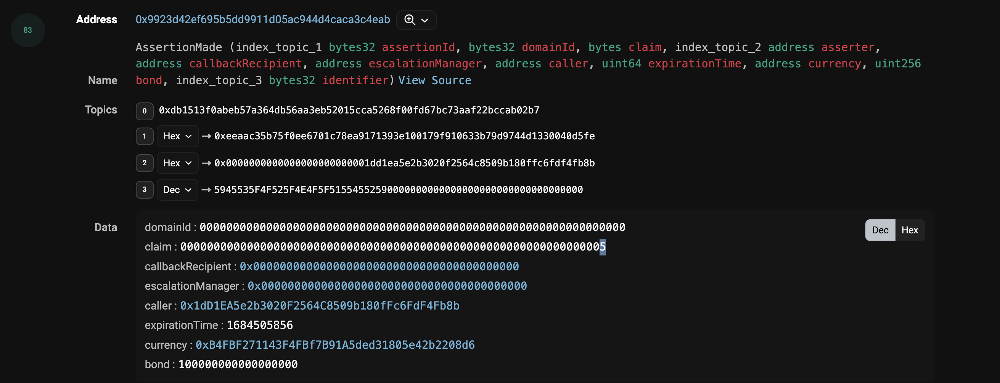
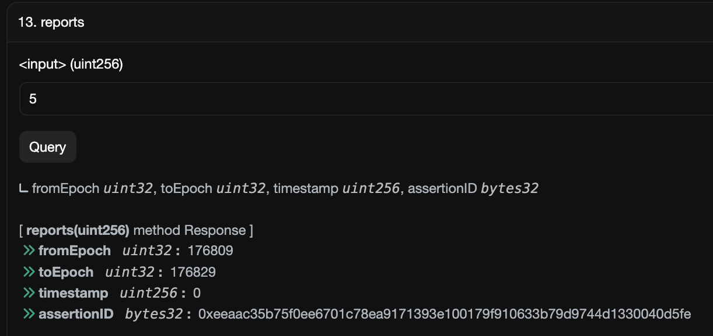
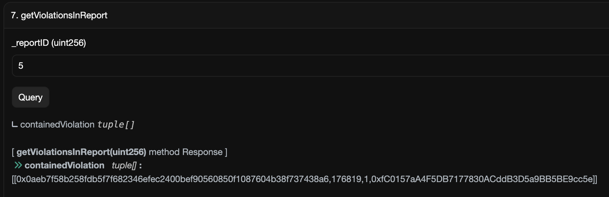

## Headers

| UMIP 177 | |
| --- | --- |
| UMIP Title | ROPU_ETHx |
| Authors | Gabriel Astieres |
| Status | Draft |
| Created | 03/04/23 |
| Discourse Link | |

# Summary

The DVM should support price requests for ROPU_ETHx. ROPU_ETHx reflects violations of the MEV-policy committed by validators of the ETHx staking protocol. The Rated Oracle will be producing reports that contain violations of ETHx’s fee recipient policy, on pre-determined 24h intervals, after surveying all the block proposals tied to ETHx validators that have transpired in said window.

This price identifier will be used on the Optimistic Oracle V3.

# Motivation

Approving this price identifier will allow Rated to serve data on chain to the ETHx staking protocol, made by Stader Labs. This data will reflect validators’ behaviour regarding ETHx’s MEV policy. The protocol gaining access to this data on chain will enable it to enforce a penalty  mechanism to the bond that each validator is asked to post.

# Data Specifications

The data to refer to when determining the validity of a report is the blockchain itself. In order to access it, one can use a node they have access to or review popular block explorers for the validity of the assertion in the report.

There are two things to look out for here:

- Execution Layer data: determine what is the appropriate **fee recipient address** that a ETHx validator that proposed a block is expected to share its EL proceeds with.
- Beacon Chain data: the Beacon Chain slot (and its equivalent Execution Layer block number) a validator from the ETHx set was selected to propose.

# Price Feed Implementation

No price feed implementation is possible for ROPU_ETHx.

## Ancillary Data Specifications

The ancillary data for price requests from ROPU_ETHx will be generated by smart contracts and will not allow for user input. The ancillary data will be a byte representation in hexadecimal of an unsigned integer.

This unsigned integer is the ID of the report in the Rated smart contract. Using this ID, any one can access to the corresponding report via this mapping. Each claim on the Optimistic Oracle V3 will verify one report, with its corresponding ID specified in the Ancillary Data field.

The Optimistic Oracle V3 will determine whether or not the following report contains all `violations` that happened during the period it covers. It will also verify that the `Violations` it contains are legitimate **based on the rules that define what a violation is**.

```solidity
mapping(uint256 => Report) public reports; // Mapping of the reports against their ID.
```

**A report is of the following form:**

```solidity
    struct Report {
        uint32 fromEpoch;
        uint32 toEpoch;
        uint256 timestamp;
        bytes32 assertionID;
        Violation[] listViolations;
    }
```

- `fromEpoch`: Is the Beacon Chain's epoch number at which the given report starts.
- `toEpoch`: Is the Beacon Chain's epoch number at which the given report ends.
- `timestamp`: Is the timestamp at which the RatedOracle noticed that the report was challenged on the Optimistic Oracle. If the report is not challenged during the appropriate time window, this value is 0.
- `assertionID`: ID of the claim associated to this report on the UMA Optimistc Oracle.
- `listViolations`: The list of violations flagged between `fromEpoch` to `toEpoch` on the Beacon Chain.

**A violation is represented with the following struct:**

- `validatorIdentifier`: The element allowing ETHx to identify which validator is concerned by this violation. The value is the `keccak256` hashed public key of the concerned validator.
- `epochNumber`: The Beacon Chain's epoch number at which the violation occurred.
- `penaltyType`: A number describing which kind of penalty to apply to this validators based on ETHx’s MEV policy.
- `newFeeRecipientAddress`: The address the validator broke the policy with. This should be different to the address that a validator is expected to share rewards with.

    ```solidity
    struct Violation {
            bytes32 validatorIdentifier;
            uint32 epochNumber;
            uint32 penaltyType;
            address newFeeRecipientAddress;
        }
    ```

# Rationale

The list of MEV policy violations committed by validators of the ETHx set is reported on a 24-hour cadence and stored on a Rated smart-contract.

Each of those daily reports will be the object of a claim on the Optimistic Oracle. When a new claim is created, a bytes representation of the report ID is included in the Ancillary Data field. The Oracle is then responsible for verifying that the associated violations list is complete and that the included violations meet the criteria described in the implementation section. The list should be empty if no violations were found.

The report covers a specific time period, start and end designated by an epoch number of the beacon chain. Only events that occurred during this time period are considered when evaluating the report. The claim is marked as correct only if all the violations are appropriate, and none have been missed.

A violation is made of 4 elements: `validatorIdentifier`, `epochNumber`, `penaltyType`, `newFeeRecipientAddress` that were described in the previous section. All those 4 elements should be reflecting the reality of what happened on chain to be considered correct.

It's important to note that a validator's status regarding the ETHx MEV policy may change over time. Therefore, proposed and missed violations should be evaluated against the validator's state at the time of the suspected violation.

# Implementation

In order for voters to determine the validity of the claim, they should refer to the following contracts:

- The Rated smart contract, which is the original creator of the claim.
- The ETHx config, which lists all the addresses of the ETHx protocol. Information needed to get validators’ state will be held in `PermissionlessNodeRegistry` and `PermissionedNodeRegistry`. On Ethereum mainnet, this contract is deployed at `0x4ABEF2263d5A5ED582FC9A9789a41D85b68d69DB`.

**The steps to evaluate a report are the following:**

1. Voters should decode the ancillary data to get the corresponding `ID` of the report to examine.
2. Voters should read the storage of the Rated smart contract in the `reports` mapping to access the corresponding report.
3. Voters should get from the report what time window it covers. Using `fromEpoch` and `toEpoch` marking when it begins and ends using Beacon Chain epoch numbers.
4. Voters should access the list of `Violations` contained in the report. If the list is empty, this means that no violations were found for the given period.
5. For each of the `Violation` contained, voters should attest to its accuracy.
To do so, voters should search for validators from the ETHx protocol who proposed blocks during the relevant time period. If these validators received MEV or priority fees payments, they should have received them at predetermined addresses based on whether they belong to the `Permission-less` or `Permissioned` pool and whether they opted-in to the socialisation of MEV rewards. A table of acceptable payment addresses for each scenario is provided below.  
When a block is coming from an MEV-relay, the `newFeeRecipientAddress` should be the end of block transfer that the builder used to pay the proposer. However, in some instances, builders pay the proposer through an internal transaction. In such cases, when the appropriate ETHx address is paid, this does not constitute a violation. More on this new form of payment in this [Rated post](https://feedback.rated.network/p/updating-ethereum-el-mev-boost-rewards-attribution-methodology-to-capture).
6. Finally, if voters identify any violations that occurred during the period and were not reported, the report should be considered incomplete, and the claim should be marked as false.

| Penalty type | Pool type | Socializing pool opt-in | Expected fee recipient address |
| --- | --- | --- | --- |
| 1 | Permission-less | No | Permission-less socialising pool OR Operator’s EL reward vault address |
| 2 | Permission-less | Yes | Permission-less socialising pool |
| 3 | Permission-less | Opted-out in the last 3 epochs* | Permission-less socialising pool  |
| 4 | Permission-less | Opted-out more than 3 epochs ago* | Permission-less socialising pool OR Operator’s EL reward vault address |
| 5 | Permission-less | Opted-in in the last 3 epochs*  | Permission-less socialising pool OR Operator’s EL reward vault address  |
| 6 | Permission-less | Opted-in more than 3 epochs ago* | Permission-less socialising Pool  |
| 7 | Permissioned | n/a  | Permissioned socialising Pool  |


💡 \* 3 epochs exclusive between the reported violation and opt-in/out action of the operator.

💡 The fee recipient addresses on the ROPU report should be different than those on the table above, for their respective penalty types.

### An example:

This transaction is a new report brought by Rated on chain: [transaction](https://goerli.etherscan.io/tx/0xd767d6b92354273068c4078028c86f37f0e89754f7f56fe590b2edd42fac5a5f)

The new report creates a claim on the Optimistic Oracle v3.



This claim is linked to the report number 5 on the Rated Oracle. The voters should retrieve the content of this report by reading the **`reports`** mapping in the Rated Oracle.



The voters should also look for the violations contained in the said report by calling the getter **`getViolationsInReport`:**



Now that those value were retrieved, the voters have all the elements to determine the validity of the report. As seen above, this report covers the period of time between epoch `176809` and `176829` of the beacon chain (prater in this example).

In this example, the report contains 1 violation. It is said to be perpetrated on epoch `176819`. Indeed, this block was proposed by a validator from the ETHx set. This validator’s pubkey is `0x810e0df7e6b08dbb0528099432fc4e60acbc5a2f5bc3d6e3559c1003dc58137de0ff2e868e5ec414d7f4e0886cf096d4` and the Validator Identifier is correct, this can be checked by calling the pure function `getPubkeyRoot`.

This validator belongs to the permission-less pool. Voters have therefore to check that either the transaction at the end of the block or the fee recipient is one of acceptable addresses as defined in the previous table. For this slot, the recipient of the transaction at the end of the block is `0x6da4c7af13ecb85c5283b0b78fbd3c204efb2c0c` which is the ETHx permissionless socializing pool. Therefore, this validator did not violate the ETHx policy, and this does not constitue a valid violation, making this example report incorrect.

# Security Considerations

When resolving a dispute, the process in the DVM shall ensure two things at once:

- (i) That every violations presented in the associated report are correct.
- (ii) That the report is complete and that it includes every violation in the time frame concerned.

Also, the Rated Smart Contract, expects the disputed reports to settle in less than 4 days, considering a new vote every 2 days and 2 days long process. In the eventuality that it doesn’t happen because the quorum is not reached, the report will be discarded and a new one will be made.
